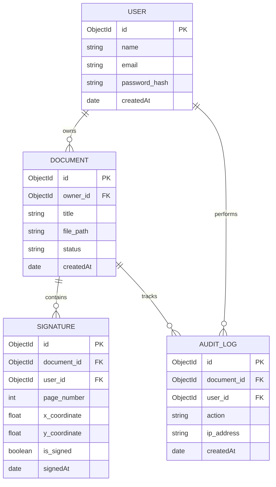
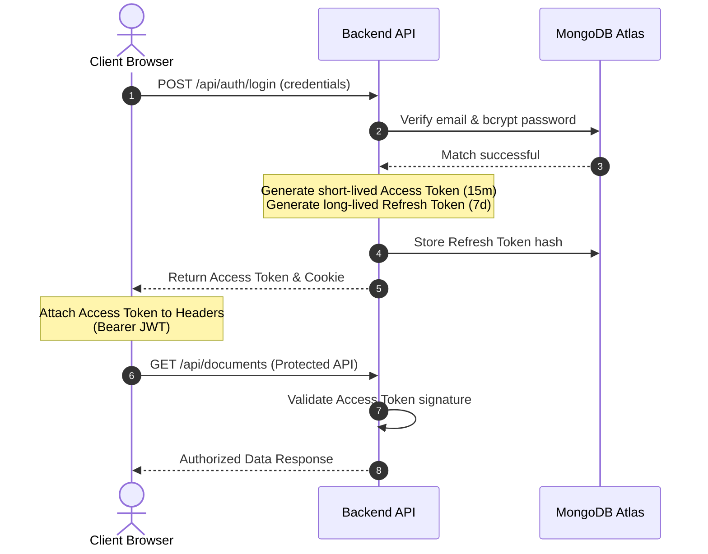
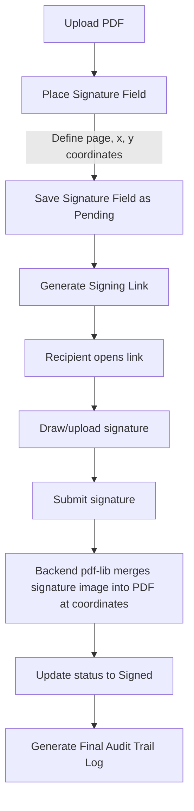

# DocSign: Full-Stack Document Signature & Audit Platform
### Technical Project Presentation & Internship Review

This document serves as the presentation guide for the DocSign platform, detailing the architecture, implementation choices, database design, and key engineering challenges solved during the internship.

---

## 1. Project Overview & Meta Information

*   **Project Title**: DocSign – A Full-Stack Document Signature & Audit Platform
*   **Presenter**: Ramsurya
*   **Role**: Software Engineer Intern
*   **Internship Period**: [Start Date] – [End Date]
*   **Organization**: [Company/Institution Name]
*   **Academic Supervisor**: [Supervisor Name]
*   **Industry Mentor**: [Mentor Name]
*   **Primary Development IDE**: **VS Code** (Visual Studio Code)

```
┌─────────────────────────────────────────────────────────────────┐
│                           DocSign                               │
│        Full-Stack Document Signature & Audit Platform           │
│                                                                 │
│   Presenter: Ramsurya                 Academic Supervisor: [...] │
│   Role: Software Engineer Intern      Industry Mentor:     [...] │
│   IDE: VS Code                        Workspace: Monorepo        │
└─────────────────────────────────────────────────────────────────┘
```

---

## 2. Problem Statement & Industry Value

*   **Paper-Based Bottlenecks**: Physical printing, signing, scanning, and mailing processes are slow, operationally expensive, and prone to delays.
*   **Security & Tampering Risks**: Standard PDFs sent via email attachments can be easily edited or falsified without detection.
*   **Lack of Chain of Custody**: Hard to prove *who* signed a document, *when* it was signed, and *whether* it has been altered since.
*   **Subscription Costs**: Third-party services charge high per-document envelope fees, creating scale barriers for small/medium enterprises.
*   **Industry Value & Business Case**:
    *   **Reduced Turnaround Time**: Shrinks contract execution cycles from days to minutes.
    *   **Cost Efficiency**: Self-hosted model eliminates high monthly per-envelope subscriptions.
    *   **Enhanced Security & Accountability**: Digital audit trails provide compliance verification for NDAs, HR forms, and vendor agreements.

---

## 3. Project Objectives

*   **Robust Session & API Security**: Implement double-token JWT authentication (Access & Refresh tokens) with protected route guards.
*   **Client-Side PDF Rendering**: Build an interactive PDF viewer allowing coordinates-based drag-and-drop signature field placement.
*   **Immutable Activity Tracking**: Automate audit logging for every document lifecycle state (upload, view, field placement, signature, deletion).
*   **Guest Signer Gateway**: Design temporary, tokenized public signing links with expiration thresholds.
*   **Scalable Development Pipeline**: Establish a CI/CD-ready monorepo workspace for reliable deployments.

---

## 4. System Architecture


---

## 5. Technology Stack & Language Choices

*   **Frontend Client**:
    *   **React 18**: Chosen for its virtual DOM and component reusability, enabling high-performance canvas renders.
    *   **TypeScript**: Utilized to enforce strict typing across APIs, eliminating runtime type mismatches.
    *   **Vite**: Selected for fast Hot Module Replacement (HMR) and optimized build bundling.
    *   **Tailwind CSS**: Speed up design utilizing responsive, maintainable utility styling.
    *   **React PDF**: Handles vector-to-canvas rendering of binary PDF pages.
*   **Backend Services**:
    *   **Node.js**: Event-driven, non-blocking asynchronous architecture suited for file-heavy network apps.
    *   **Express.js**: Lightweight framework providing clean REST API routing and middleware pipelines.
    *   **pdf-lib**: Backend PDF manipulator capable of embedding visual signatures directly into PDF bytes.
*   **Database**:
    *   **MongoDB Atlas**: JSON-document model perfectly suits hierarchical, nested document data models (NDAs, dynamic signers, audit arrays) without heavy SQL joins.
    *   **Mongoose**: Models data schema structure and handles middleware queries.

---

## 6. Database Design & Entity Relationships



---

## 7. Authentication & JWT Workflow



---

## 8. Document Upload Lifecycle

1.  **Frontend Validation**: File input constraints filter for MIME type `application/pdf` and file sizes under 10MB.
2.  **FormData Streaming**: Multer middleware parses incoming multi-part data stream on Express.
3.  **Physical Storage**: Generates a UUID filename to prevent collisions, writing files to a persistent volume disk mount.
4.  **Database Persistence**: Document schema saves the title, size, status (`pending`), and target path.
5.  **Audit Trail Entry**: Triggers an automatic audit record: `DOCUMENT_UPLOADED`.

---

## 9. Coordinate-Based Signature Workflow



---

## 10. Backend API Design

| Endpoint | Method | Authentication | Description |
| :--- | :--- | :--- | :--- |
| `/api/auth/register` | `POST` | Public | Create new account |
| `/api/auth/login` | `POST` | Public | Authenticate user & issue tokens |
| `/api/auth/refresh` | `POST` | Public | Re-issue Access Token using Refresh Token |
| `/api/documents` | `POST` | JWT (Required) | Upload PDF file |
| `/api/documents` | `GET` | JWT (Required) | Retrieve user's document list |
| `/api/signatures` | `POST` | JWT (Required) | Add signature fields to a document |
| `/api/signatures/:id/sign`| `POST` | Public / Link | Execute signature and update PDF |
| `/api/audit/:docId` | `GET` | JWT (Required) | Retrieve history/trail for a document |

---

## 11. Frontend Client Architecture

*   **Project Organization**:
    *   `/components`: Modular elements (Sidebar, Layouts) and atomic components (`/ui/Button`, `/ui/Input`).
    *   `/context`: Authentication provider (`AuthContext`) handling token storage.
    *   `/pages`: Route-level screen controllers (Dashboard, Detail, Upload, Sign).
    *   `/services`: API wrappers using a configured Axios instance (attaches JWT headers automatically).
    *   `/utils`: Formatters, validators, and token storage operations.

```
frontend/src/
├── components/ (Layouts, UI, Sidebar)
├── context/    (AuthContext)
├── pages/      (Dashboard, Detail, Sign, Upload)
├── services/   (API handlers using Axios)
└── utils/      (Storage, format helpers)
```

---

## 12. Engineering Challenges & Solutions

*   **Resilient Database Startup Sequence**:
    *   *Problem*: A blocking database connection sequence (`await connectDB()`) prevented the Express web server from binding to the port. When MongoDB connection took more than a few seconds, the cloud healthcheck failed.
    *   *Solution*: Made connection sequence asynchronous. The web server binds and starts listening immediately, allowing healthcheck requests to succeed while the database connection completes in the background.
*   **Monorepo Workspace Deployments**:
    *   *Problem*: Monorepo deploy runners failed with `MODULE_NOT_FOUND` because they tried to execute `node dist/app.js` from the repository root instead of the workspace folder.
    *   *Solution*: Created a custom `railway.json` and root `"start"` script to configure the workspace runners to execute `npm start` (which runs the backend workspace project).

---

## 13. Testing & Validation

*   **TypeScript Compilations**:
    *   Both backend and frontend are strictly type-validated locally and in GitHub CI checks (`tsc`).
*   **Database Seeding**:
    *   A custom seed script (`npm run seed --workspace=backend`) connects to MongoDB Atlas to populate default demo users.
*   **End-to-End browser verification**:
    *   Tested the complete user flow (login, PDF upload, coordinates selection, signing link validation) using Chrome DevTools MCP script injection.
    *   Visual interfaces verified across responsive layouts.

---

## 14. Future Roadmap

*   **Multi-Signer Workflow**: Support sequential signing orders (User A -> User B -> User C) with status notifications.
*   **Cloud Object Storage**: Move local disk uploads to secure cloud storage (AWS S3, Google Cloud Storage) for infinite scaling.
*   **Email Notification Engine**: Automated email alerts for signers when a document is ready or completed (using SendGrid or Nodemailer).
*   **A11y & PDF Parsing**: Advanced OCR and text reflow to support accessibility standards inside the PDF viewer.
*   **Digital Certificates**: Implementing cryptographic certificate authorities (PKI) for legally compliant digital signatures.

---

## 15. Conclusion & Key Learnings

*   **Monorepo Workspaces**: Gained expertise in structuring, configuring, and building multiple projects (React & Node) inside a single monorepo.
*   **Full Stack Integration**: Handled complex state management, client-side rendering of binary PDFs, coordinate mappings, and background tasks.
*   **Resilient Design**: Developed error handling structures, JWT token refresh flows, and non-blocking startup sequences.
*   **Production Deployments**: Successfully managed Vercel and Railway integration pipelines, debugging cloud environment errors.
