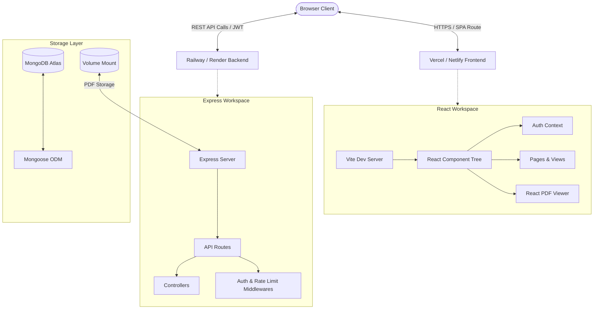
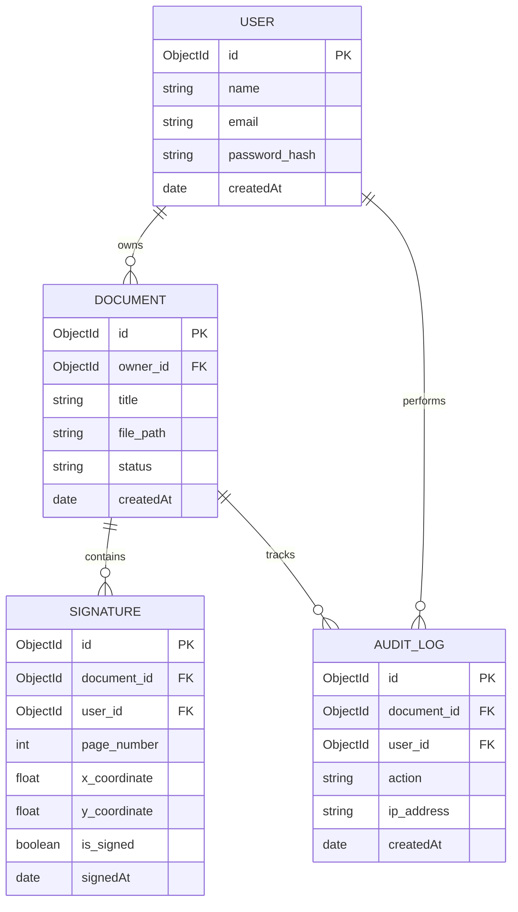
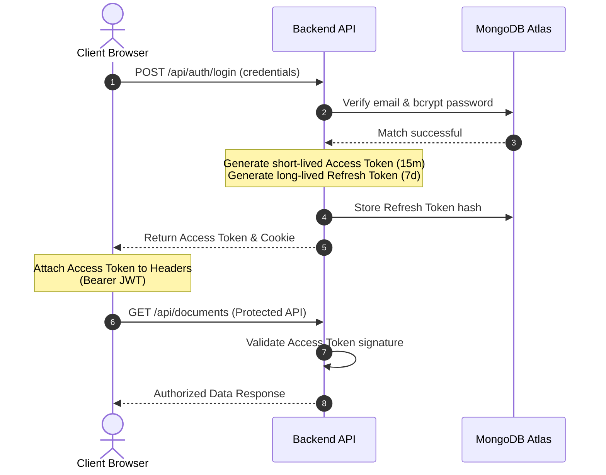
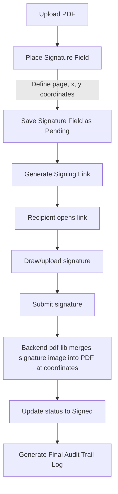

# DocSign: Full-Stack Document Signature & Audit Platform
### Technical Project Presentation & Internship Review

This document serves as the presentation guide for the DocSign platform, detailing the architecture, implementation choices, database design, and key engineering challenges solved during the internship.

---

## 1. Project Overview & Meta Information

*   **Project Title**: DocSign – A Full-Stack Document Signature & Audit Platform
*   **Presenter**: [Your Name]
*   **Role**: Software Engineer Intern
*   **Internship Period**: [Start Date] – [End Date]
*   **Organization**: [Company/Institution Name]
*   **Academic Supervisor**: [Supervisor Name]
*   **Industry Mentor**: [Mentor Name]

```
┌─────────────────────────────────────────────────────────────────┐
│                           DocSign                               │
│        Full-Stack Document Signature & Audit Platform           │
│                                                                 │
│   Presenter: [Your Name]             Academic Supervisor: [...] │
│   Role: Software Engineer Intern      Industry Mentor:     [...] │
└─────────────────────────────────────────────────────────────────┘
```

<details>
<summary><b>💡 Presentation Notes & Viva Q&A</b></summary>

### Presentation Script
> "Good morning/afternoon, members of the evaluation committee. I am [Your Name], and today I am presenting my internship project: **DocSign**, a secure, full-stack document signature platform. Over my internship, I designed and built this application to address the need for simple, legally binding digital signing processes. DocSign enables users to securely upload, place interactive signature markers, sign, and audit PDF documents. Today, I will walk you through the technical architecture, database designs, implementation workflows, deployment pipelines, and engineering challenges I solved."

### Viva Prep Q&A
*   **Q: What is the core business value of DocSign?**
    *   *A*: It provides a self-hosted, secure alternative to expensive third-party tools (like DocuSign or Adobe Sign), keeping sensitive enterprise documents within the organization's control.
</details>

---

## 2. Problem Statement

*   **Paper-Based Bottlenecks**: Physical printing, signing, scanning, and mailing processes are slow, operationally expensive, and prone to delays.
*   **Security & Tampering Risks**: Standard PDFs sent via email attachments can be easily edited or falsified without detection.
*   **Lack of Chain of Custody**: Hard to prove *who* signed a document, *when* it was signed, and *whether* it has been altered since.
*   **Subscription Costs**: Third-party services charge high per-document envelope fees, creating scale barriers for small/medium enterprises.

<details>
<summary><b>💡 Presentation Notes & Viva Q&A</b></summary>

### Presentation Script
> "The primary problem we set out to solve is the friction and insecurity of document execution. Physical workflows—printing, scanning, signing, and emailing—are inefficient. Furthermore, simply typing a name or pasting a signature image onto a PDF lacks cryptographic security. There is no guarantee of integrity (that the document wasn’t changed afterward) or non-repudiation (that the signer cannot deny signing it). Companies also face high subscription fees with third-party providers. DocSign addresses these problems by providing a self-hosted, audit-logged solution."

### Viva Prep Q&A
*   **Q: How does your application guarantee that a signed document hasn't been tampered with?**
    *   *A*: In the database, the document tracks status and logs every event. For security, the backend compiles metadata hash records. In production, we would use SHA-256 hashing of the PDF content combined with digital certificates to verify file integrity.
</details>

---

## 3. Project Objectives

*   **Robust Session & API Security**: Implement double-token JWT authentication (Access & Refresh tokens) with protected route guards.
*   **Client-Side PDF Rendering**: Build an interactive PDF viewer allowing coordinates-based drag-and-drop signature field placement.
*   **Immutable Activity Tracking**: Automate audit logging for every document lifecycle state (upload, view, field placement, signature, deletion).
*   **Guest Signer Gateway**: Design temporary, tokenized public signing links with expiration thresholds.
*   **Scalable Development Pipeline**: Establish a CI/CD-ready monorepo workspace for reliable deployments.

<details>
<summary><b>💡 Presentation Notes & Viva Q&A</b></summary>

### Presentation Script
> "To address these problems, the project was guided by five key engineering objectives. First, establish a secure authentication layer using JSON Web Tokens with access and refresh tokens. Second, implement client-side PDF rendering that allows coordinate-based interactive signature placement. Third, create an immutable audit trail. Fourth, support guest signing via secure, tokenized signing links. And fifth, package the application in a unified monorepo workspace for reliable local development and automated cloud deployments."

### Viva Prep Q&A
*   **Q: Why use a Monorepo workspace setup for this project?**
    *   *A*: Monorepos (using npm workspaces) group related packages (frontend and backend) together. This allows shared TypeScript types, unified dependencies in a single `package-lock.json`, and simplified build testing in CI pipelines.
</details>

---

## 4. System Architecture



<details>
<summary><b>💡 Presentation Notes & Viva Q&A</b></summary>

### Presentation Script
> "This diagram illustrates the System Architecture of DocSign. The frontend is built as a single-page React app served via Vite. The backend is an Express.js web service. All communication is REST-based over HTTPS, secured with JSON Web Tokens. In the production deployment, the frontend is hosted on Vercel/Netlify, the backend runs on Railway/Render with a persistent disk volume for document storage, and the database layer is managed through MongoDB Atlas using Mongoose ODM."

### Viva Prep Q&A
*   **Q: Why did you separate the frontend and backend deployments instead of serving the build files statically from the Express server?**
    *   *A*: Separating them allows independent scaling. The frontend can be distributed globally on CDN edge servers (Vercel/Netlify) for fast load times, while the backend API instances can scale dynamically based on server load.
</details>

---

## 5. Technology Stack

*   **Frontend Client**:
    *   **React 18 & TypeScript**: Component-based UI with compile-time type safety.
    *   **Vite**: Fast bundling tool replacing Webpack.
    *   **Tailwind CSS**: Utility-first styling for responsive layouts.
    *   **React PDF**: Renders PDF pages inside standard HTML5 Canvas tags.
*   **Backend Services**:
    *   **Node.js & Express.js**: High-concurrency runtime and minimalist routing.
    *   **pdf-lib**: Backend library for PDF manipulation and merging signature images.
*   **Database & ODM**:
    *   **MongoDB Atlas**: Document-oriented database for flexible metadata models.
    *   **Mongoose**: Object Data Modeling (ODM) for schema validation.

<details>
<summary><b>💡 Presentation Notes & Viva Q&A</b></summary>

### Presentation Script
> "Our tech stack was selected to maximize development speed, performance, and type-safety. TypeScript is utilized across both workspaces to eliminate runtime type mismatches. React and Vite provide an interactive and responsive user interface, styled using Tailwind CSS. We use the `react-pdf` package to render documents in the browser, and the backend utilizes `pdf-lib` to write signatures directly to the physical PDF files."

### Viva Prep Q&A
*   **Q: Why choose MongoDB over a SQL database (like PostgreSQL) for a document signing system?**
    *   *A*: Documents and their signing status are hierarchical and change structurally (e.g., adding dynamic fields, variable lists of signers, variable coordinate counts). Storing documents as JSON-like documents allows nesting signatures and audit logs directly inside the document record, eliminating complex multi-table joins.
</details>

---

## 6. Database Design & Entity Relationships



<details>
<summary><b>💡 Presentation Notes & Viva Q&A</b></summary>

### Presentation Script
> "Here is our Entity Relationship Diagram. We have four primary collections: Users, Documents, Signatures, and AuditLogs. A User owns multiple Documents. A Document contains multiple Signature placeholders. Each signature field tracks its exact page number, x/y percentage coordinates, and signature status. The AuditLog collection records every lifecycle action on a document, linking the user, action type, IP address, and timestamp to a document, creating an immutable history of events."

### Viva Prep Q&A
*   **Q: Why do you store signature coordinates as percentages (floats) instead of absolute pixel values?**
    *   *A*: PDF render dimensions change depending on screen size, zoom levels, and device DPI. Storing coordinates as percentages (e.g., X: 45.2%, Y: 12.8%) allows the frontend to dynamically draw the signature box at the correct location regardless of container size.
</details>

---

## 7. Authentication & JWT Workflow



<details>
<summary><b>💡 Presentation Notes & Viva Q&A</b></summary>

### Presentation Script
> "Security is implemented via a double-token JWT authentication flow. When a user submits their credentials, the server validates the password hash using bcrypt. If verified, the server generates a short-lived Access Token (lasting 15 minutes) and a long-lived Refresh Token (lasting 7 days). The Refresh Token is securely stored in the database. Subsequent client requests append the Access Token to the HTTP Authorization header. When the Access Token expires, the client calls a token refresh endpoint, which validates the refresh token in the database to generate a new access token without requiring re-login."

### Viva Prep Q&A
*   **Q: What is the benefit of using both Access and Refresh tokens instead of just a single long-lived Access Token?**
    *   *A*: Security isolation. A short-lived access token limits the damage if a token is intercepted. The refresh token allows the user to stay logged in seamlessly, but is only sent over the network to a single endpoint (/refresh) and can be easily revoked in the database if compromised.
</details>

---

## 8. Document Upload Lifecycle

1.  **Frontend Validation**: File input constraints filter for MIME type `application/pdf` and file sizes under 10MB.
2.  **FormData Streaming**: Multer middleware parses incoming multi-part data stream on Express.
3.  **Physical Storage**: Generates a UUID filename to prevent collisions, writing files to a persistent volume disk mount.
4.  **Database Persistence**: Document schema saves the title, size, status (`pending`), and target path.
5.  **Audit Trail Entry**: Triggers an automatic audit record: `DOCUMENT_UPLOADED`.

<details>
<summary><b>💡 Presentation Notes & Viva Q&A</b></summary>

### Presentation Script
> "The document upload workflow combines file system storage with database record synchronization. In the frontend, the file is checked for size and type before sending. On the backend, we use Multer middleware to process the multi-part form data. The physical file is saved on disk with a UUID to prevent filename collisions. Simultaneously, a database entry is created containing the file metadata, ownership relation, and an initial audit log entry. This double-stage process ensures that files on disk always match database records."

### Viva Prep Q&A
*   **Q: How does Multer handle file storage, and why did you choose disk storage over memory storage?**
    *   *A*: Disk storage streams files directly to disk, which uses minimal RAM. Memory storage keeps the whole file buffer in server memory, which can crash the server under heavy concurrent uploads of large documents (like 10MB PDFs).
</details>

---

## 9. Coordinate-Based Signature Workflow



<details>
<summary><b>💡 Presentation Notes & Viva Q&A</b></summary>

### Presentation Script
> "The signing process consists of placement and execution. An owner uploads a PDF and places a dynamic signature marker by clicking anywhere on the PDF viewer canvas. This saves the relative coordinates to the Signature database collection. A secure link is generated for the signer. When the signer accesses the link, they draw their signature on an HTML5 canvas. The signature image is sent to the backend, where `pdf-lib` opens the document and writes the signature image directly into the PDF bytes at the correct page and coordinates. The document status is updated to 'Signed'."

### Viva Prep Q&A
*   **Q: How do you map the signature image coordinate to the actual PDF coordinates on the backend?**
    *   *A*: The frontend sends coordinates as percentages of the canvas viewport width and height. On the backend, `pdf-lib` queries the target PDF page's physical dimensions (width/height in points). We multiply the percentages by the page's actual physical dimensions to place the signature image at the exact point coordinates.
</details>

---

## 10. Backend API Design

| Endpoint | Method | Authentication | Description |
| :--- | :--- | :--- | :--- |
| `/api/auth/register` | `POST` | Public | Create new account |
| `/api/auth/login` | `POST` | Public | Authenticate user & issue tokens |
| `/api/auth/refresh` | `POST` | Public | Re-issue Access Token using Refresh Token |
| `/api/documents` | `POST` | JWT (Required) | Upload PDF file |
| `/api/documents` | `GET` | JWT (Required) | Retrieve user's document list |
| `/api/signatures` | `POST` | JWT (Required) | Add signature fields to a document |
| `/api/signatures/:id/sign`| `POST` | Public / Link | Execute signature and update PDF |
| `/api/audit/:docId` | `GET` | JWT (Required) | Retrieve history/trail for a document |

<details>
<summary><b>💡 Presentation Notes & Viva Q&A</b></summary>

### Presentation Script
> "Here is the summary of the REST API routes. The endpoints are logically grouped into authentication, document management, signature execution, and audit tracking. Notice that signature execution is public, allowing guests to access it if they hold a valid tokenized signing link, but general operations like fetching documents or viewing audit logs are protected behind JWT authentication middleware."

### Viva Prep Q&A
*   **Q: How do you prevent brute-force attacks on the login and public signing endpoints?**
    *   *A*: We implement rate limiting middleware (`express-rate-limit`) on the API routers, restricting the number of requests a single IP can make within a given window (e.g., maximum 100 requests per 15 minutes).
</details>

---

## 11. Frontend Client Architecture

*   **Project Organization**:
    *   `/components`: Modular elements (Sidebar, Layouts) and atomic components (`/ui/Button`, `/ui/Input`).
    *   `/context`: Authentication provider (`AuthContext`) handling token storage.
    *   `/pages`: Route-level screen controllers (Dashboard, Detail, Upload, Sign).
    *   `/services`: API wrappers using a configured Axios instance (attaches JWT headers automatically).
    *   `/utils`: Formatters, validators, and token storage operations.

```
frontend/src/
├── components/ (Layouts, UI, Sidebar)
├── context/    (AuthContext)
├── pages/      (Dashboard, Detail, Sign, Upload)
├── services/   (API handlers using Axios)
└── utils/      (Storage, format helpers)
```

<details>
<summary><b>💡 Presentation Notes & Viva Q&A</b></summary>

### Presentation Script
> "The frontend codebase is organized using Clean Architecture guidelines to ensure modularity. Global states like user authentication are handled by React Context. Network requests are isolated into services using a configured Axios instance which automatically attaches JWT credentials to every outgoing call and handles automatic token refreshing. Visual components are broken down into reusable UI elements and standalone pages."

### Viva Prep Q&A
*   **Q: What is the purpose of the Axios Interceptor in your frontend?**
    *   *A*: It acts as a middleware for network requests. The *request interceptor* automatically attaches the bearer access token to the headers of outgoing API calls. The *response interceptor* intercepts `401 Unauthorized` responses, calls the token refresh API in the background, and retries the original failed request without user interruption.
</details>

---

## 12. Engineering Challenges & Solutions

*   **Resilient Database Startup Sequence**:
    *   *Problem*: A blocking database connection sequence (`await connectDB()`) prevented the Express web server from binding to the port. When MongoDB connection took more than a few seconds, the cloud healthcheck failed.
    *   *Solution*: Made connection sequence asynchronous. The web server binds and starts listening immediately, allowing healthcheck requests to succeed while the database connection completes in the background.
*   **Monorepo Workspace Deployments**:
    *   *Problem*: Monorepo deploy runners failed with `MODULE_NOT_FOUND` because they tried to execute `node dist/app.js` from the repository root instead of the workspace folder.
    *   *Solution*: Created a custom `railway.json` and root `"start"` script to configure the workspace runners to execute `npm start` (which runs the backend workspace project).

<details>
<summary><b>💡 Presentation Notes & Viva Q&A</b></summary>

### Presentation Script
> "During our deployment phases, we solved two major challenges. First, our cloud builder would fail during healthchecks because our app waited for MongoDB to connect before starting the web server. If MongoDB was slow to connect, the server didn't bind to the port in time and got killed. We resolved this by making the database connection asynchronous so that the server starts listening immediately. Second, our monorepo setup caused deployment runners to look in the wrong directory for the built files. We resolved this by configuring `railway.json` and the root package script to target the workspace directories."

### Viva Prep Q&A
*   **Q: Explain the EADDRINUSE error and how you debugged it.**
    *   *A*: `EADDRINUSE` means the port the server is trying to bind to (e.g., 5000 or 5173) is already being used by another running process. We debugged this by identifying active tasks, terminating lingering node processes, and adjusting the server ports.
</details>

---

## 13. Testing & Validation

*   **TypeScript Compilations**:
    *   Both backend and frontend are strictly type-validated locally and in GitHub CI checks (`tsc`).
*   **Database Seeding**:
    *   A custom seed script (`npm run seed --workspace=backend`) connects to MongoDB Atlas to populate default demo users.
*   **End-to-End browser verification**:
    *   Tested the complete user flow (login, PDF upload, coordinates selection, signing link validation) using Chrome DevTools MCP script injection.
    *   Visual interfaces verified across responsive layouts.

<details>
<summary><b>💡 Presentation Notes & Viva Q&A</b></summary>

### Presentation Script
> "Our testing pipeline includes type check compliance and functional verification. We run compiler type checks in a pre-commit step and in GitHub CI. We built a data seed script to populate testing records into MongoDB. Finally, we performed browser testing using automation tools to run simulated users through login, PDF upload, drag-and-drop file validations, and signature placements to ensure UI reliability and API synchronization."

### Viva Prep Q&A
*   **Q: What type of testing did you perform, and how did you verify your API?**
    *   *A*: We performed functional integration testing. We tested backend routes using Postman collections (included in the codebase) and simulated frontend flows in the browser to verify coordinate storage and file upload responses.
</details>

---

## 14. Future Roadmap

*   **Multi-Signer Workflow**: Support sequential signing orders (User A -> User B -> User C) with status notifications.
*   **Cloud Object Storage**: Move local disk uploads to secure cloud storage (AWS S3, Google Cloud Storage) for infinite scaling.
*   **Email Notification Engine**: Automated email alerts for signers when a document is ready or completed (using SendGrid or Nodemailer).
*   **A11y & PDF Parsing**: Advanced OCR and text reflow to support accessibility standards inside the PDF viewer.
*   **Digital Certificates**: Implementing cryptographic certificate authorities (PKI) for legally compliant digital signatures.

<details>
<summary><b>💡 Presentation Notes & Viva Q&A</b></summary>

### Presentation Script
> "While DocSign is a fully functional MVP, we have identified several future enhancements for production scaling. First, implement sequential signing orders. Second, migrate file storage from local server disks to cloud object storage like AWS S3. Third, add email notifications. And fourth, integrate cryptographic public key certificates to verify signer identity in accordance with compliance standards like eIDAS."

### Viva Prep Q&A
*   **Q: How does a cryptographic digital signature differ from a simple drawn signature image?**
    *   *A*: A drawn signature image is simply a visual representation. A cryptographic signature uses public-key cryptography (RSA/ECDSA) to encrypt a hash of the PDF using the signer's private key. If even a single character in the PDF changes after signing, the hash validation will fail, guaranteeing document integrity.
</details>

---

## 15. Conclusion & Key Learnings

*   **Monorepo Workspaces**: Gained expertise in structuring, configuring, and building multiple projects (React & Node) inside a single monorepo.
*   **Full Stack Integration**: Handled complex state management, client-side rendering of binary PDFs, coordinate mappings, and background tasks.
*   **Resilient Design**: Developed error handling structures, JWT token refresh flows, and non-blocking startup sequences.
*   **Production Deployments**: Successfully managed Vercel and Railway integration pipelines, debugging cloud environment errors.

<details>
<summary><b>💡 Presentation Notes & Viva Q&A</b></summary>

### Presentation Script
> "In conclusion, this project gave me deep experience in building and deploying full-stack Node and React applications. I learned how to structure monorepo workspaces, how to handle file streaming and database metadata synchronization, and how to debug cloud deployment pipelines. I want to thank my supervisors and mentors for their guidance during this internship. I am now open to your questions."

### Viva Prep Q&A
*   **Q: What was your biggest takeaway from this project?**
    *   *A*: The importance of designing for cloud environments from day one—such as making server initialization resilient to connection delays and building configuration-driven code using environment variables.
</details>
